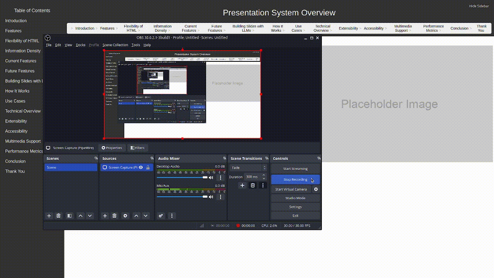

# HTML-Powered Presentation Framework

A modern, lightweight framework for creating impactful and visually appealing presentations using HTML and CSS. This project aims to transcend the limitations of traditional presentation software by emphasizing clear communication, rich content structure, and seamless customizability.

Inspired by Edward Tufte's philosophy on effective information presentation, this framework avoids the pitfalls of rigid, slide-based designs that often obscure meaning or oversimplify complex ideas. Instead, it offers flexibility and a focus on delivering data and narrative in an engaging and accessible format.

## Demonstration

---

## **Features**
- **Dynamic Theming:** Create and switch between custom styles effortlessly to match your branding or presentation context.
- **Nested Folds:** Present detailed content progressively, with collapsible slides that encourage exploration without overwhelming the audience.
- **Responsive Design:** Ensures your presentation looks great on any screen size.
- **Programmatic Slide Creation:** Simplifies generating presentations programmatically or manually.
- **Seamless Navigation:** Integrated Table of Contents (TOC) and intuitive click-to-advance features.
- **No Dependency on Proprietary Formats:** Built entirely with HTML, CSS, and JavaScript for maximum flexibility.

---

## **Why Use This Framework?**
Edward Tufte criticized the rigidity and oversimplification inherent in many traditional presentation tools, advocating for designs that prioritize content clarity and contextual richness. This framework addresses those concerns by offering:
- Full control over layout and styling.
- The ability to showcase complex data without forcing it into oversimplified templates.
- Support for hierarchical and interactive content to reveal insights at the audience's pace.

---

## **Getting Started**

### **Installation**
1. Clone the repository:

git clone https://github.com/your-username/html-presentation-framework.git cd html-presentation-framework

2. Ensure you have Python installed for running the included script.

### **Generating a Presentation**
Run the main.py script to generate your presentation:

python main.py --output_dir ./my_presentation_project --theme style-blue.css

### **Customizing Slides**
Slides are defined programmatically in main.py. Use the following example format:

slides = [ { "title": "Introduction", "content": ["
Welcome to the presentation!
"], "folds": [ { "title": "Details", "content": ["
Here is more detailed information.
"] } ], "image": "introduction_image.png", }, ]

### **Running the Presentation**
After generating the presentation, open the Example_Presentation.html file in your browser.

### **Creating Custom Themes**
Themes control the visual appearance of your presentation. To create a new theme:
1. Copy an existing theme CSS file from static/css/themes/ (e.g., style-dark.css) and rename it.
2. Customize the CSS variables to define your colors, fonts, and layout preferences:

:root { --sidebar-bg: #005f73; --sidebar-hover-bg: #0a9396; --header-bg: #94d2bd; --collapsible-bg: #e9d8a6; --collapsible-active-bg: #ee9b00; }

3. Save the file and reference it when generating your presentation:

python main.py --theme custom-theme.css

Refer to the themes.md file for more details.

## **Contributing**

Contributions are welcome! Whether you're improving features, fixing bugs, or creating new themes, your help is appreciated.

### **How to Contribute**
1. Fork the repository.
2. Create a new branch for your feature:

git checkout -b feature-name

3. Commit your changes with clear messages:

git commit -m "Add feature: Custom animations for collapsibles"

4. Push your branch and open a pull request.

## **License**
This project is licensed under the MIT License. See the LICENSE file for details.

## **Credits**
Developed with a focus on clarity, usability, and respect for the principles of effective data presentation. Inspired by the work of Edward Tufte and modern web design practices.

